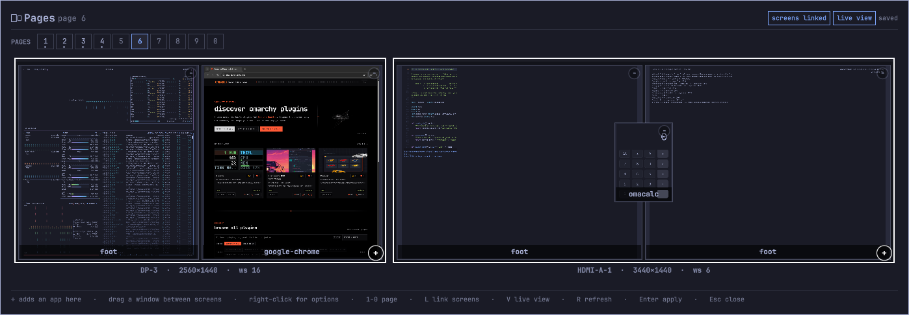
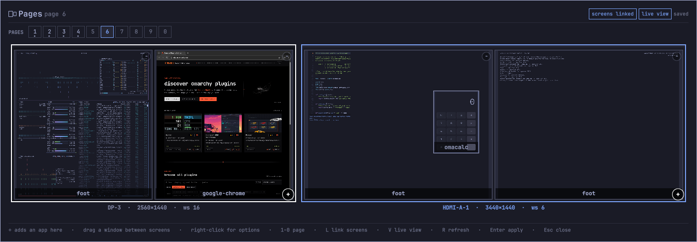
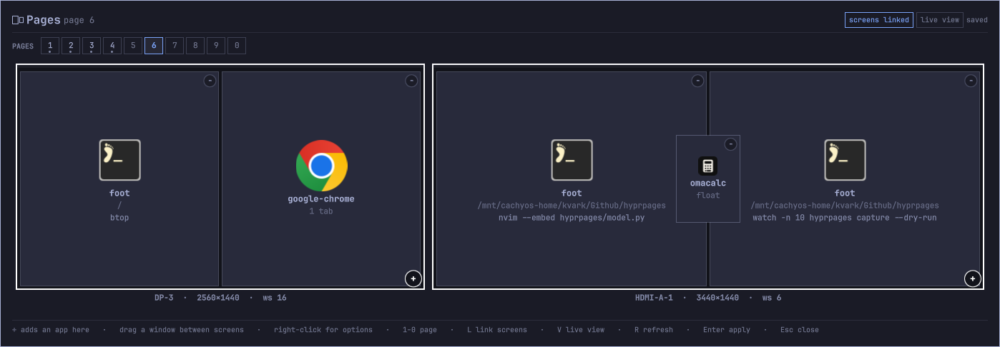
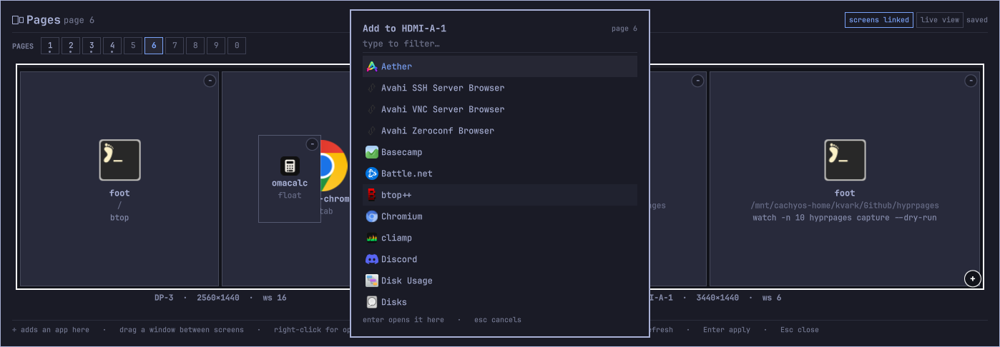

# hyprpages

See what is actually running on your Hyprland desktop, arrange it by dragging,
and get the config written for you.

Hyprland binds every workspace to exactly one monitor, so a desktop that spans
two screens cannot be expressed directly — you end up hand-writing pairs of
workspace rules and hoping the numbering stays straight.
`hyprpages` treats a **page** as the unit you actually think in: one keypress
worth of desktop, across every monitor you own.

```
page N  ->  workspace N            on the first monitor
        ->  workspace N + offset   on the second
        ->  workspace N + 2*offset on a third
```



Both monitors of one page, drawn to scale. **Live view** fills each tile with
the window's real content, so you recognise the desktop you are editing rather
than reading a list of class names.



Drag a window and the screen it will land on lights up. Let go and it moves for
real, immediately — the rule that keeps it there is written when you press
Enter.



Icons instead, when you want the labels rather than the picture. Each terminal
says where it is and what is running in it; a browser says how many tabs it has
open.



`+` on a screen adds an application to it. One that is already open moves to
where you asked for it instead of starting a second copy.

## Status

Early. The command line is tested and stable and works on any Hyprland.

**The visual editor requires [Omarchy](https://omarchy.org)** — it ships as a
plugin for Omarchy's Quickshell-based shell, and that is a deliberate choice
rather than a gap: building it there means it inherits the theme, the bar and
the keybinding conventions instead of reimplementing them. If you are on plain
Hyprland the CLI still does everything except the dragging.

## What it does

- **Reads your live desktop** — monitors, pages, every open window
- **Looks inside windows** — terminals report their working directory and the
  command actually running; browsers report their open tabs
- **Draws it to scale** — each monitor at its true proportions and real
  position, each window where it actually sits
- **Writes the config** — workspace pinning and per-app placement rules, in
  either Lua or classic `hyprland.conf` syntax
- **Moves real windows**, not just rules, so an edit has an effect immediately
- **Keeps an app with you** — pin one to every page, for the call or the player
  you want in front of you whichever page you are on
- **Works without a mouse** — every window carries a letter; press it, then a
  page number, and it goes there
- **Swaps two windows** — drop one on another to trade their places

## Requirements

- Hyprland (any version for the conf output; 0.55+ for the Lua output)
- Python 3.11+
- No Python dependencies

Optional, for richer detail: `kitty` (per-window terminal detail via its
control socket), a Chromium-family browser started with
`--remote-debugging-port` (tab lists).

## Install

On Omarchy, as a shell plugin — this is the whole thing, editor included:

```bash
omarchy plugin add https://github.com/piotrfernandez-impact10/hyprpages --enable
```

The repository *is* the plugin: `manifest.json` sits at its root and the CLI
ships inside it, so there is nothing else to install and nothing to put on
`PATH`.

From a clone, which also puts `hyprpages` on your `PATH` for terminal use:

```bash
git clone https://github.com/piotrfernandez-impact10/hyprpages
cd hyprpages && ./install.sh
```

There is deliberately no `pip install`: the tool has no dependencies, and
`pip install --user` fails outright on distributions that mark Python as
externally managed (PEP 668).

## Remove

```bash
omarchy plugin remove kvark.hyprpages
```

If you installed from a clone, also delete the symlink `install.sh` made:

```bash
rm -f ~/.local/bin/hyprpages
```

Neither touches your Hyprland configuration, because nothing here ever edited
it: `apply` only ever writes its own `~/.config/hypr/hyprpages.lua` (or
`hyprpages.conf`), which is loaded because *you* added one line to
`hyprland.lua`. To finish undoing it, delete that line and the generated file:

```bash
rm -f ~/.config/hypr/hyprpages.lua        # or ~/.config/hypr/hyprpages.conf
rm -rf ~/.config/hyprpages                # pages.json, the editor's own state
```

Your workspaces stay wherever they are; only the rules that pinned them go.

## Use

```bash
hyprpages state            # what is running right now, as JSON
hyprpages capture          # fold what is running into your configuration
hyprpages capture --dry-run # ...or just show what that would change
hyprpages apply --dry-run  # show the config that would be written
hyprpages apply            # write it and reload Hyprland
hyprpages page 3           # switch every screen to page 3
```

`apply` writes **only** its own file — `~/.config/hypr/hyprpages.lua` or
`hyprpages.conf`. Your own config is never edited. It picks the format from
whether you have a `hyprland.lua`, and tells you the one line to add:

```lua
require("hypr.hyprpages")                    -- Lua config
```
```conf
source = ~/.config/hypr/hyprpages.conf       # classic config
```

### Lua vs conf

Both express the same pinning and placement rules. The difference is how pages
switch on every screen at once:

| | Lua | conf |
|---|---|---|
| Page switching | a `workspace.active` hook, so **any** route works — keys, clicking a bar, `SUPER`+scroll | `SUPER`+number bound to `hyprpages page N` |

## How window introspection works

Getting "what is running in there" is per-application work, and the awkward
cases shaped the design.

**Terminals are not uniform.** foot, alacritty and ghostty run one process per
window, so the window's PID is enough: walk `/proc` to the deepest foreground
descendant and read its `cwd` and `cmdline`. kitty does not work that way — a
single kitty process owns every OS window and the compositor reports that same
PID for all of them, so kitty is queried over its own control socket instead.

**Detection keys on process name, not window class.** A class is whatever the
user chose; `kitty --class notes` is still kitty. Matching on the class misses
it — and the same applies to icons, which resolve through `StartupWMClass`
first and fall back to the process.

**Browser tabs come from the DevTools protocol**, so they are only available
when the browser was started with `--remote-debugging-port`. "No tabs" and
"cannot see tabs" are kept distinct rather than flattened to an empty list.

Anything unrecognised degrades to "a window with a class", which is still
enough to place it.

## Roadmap

1. **Packaging** — an AUR package, a man page, a desktop entry
2. **Page templates** — rebuild a page from nothing, launching each terminal
   with its directory and command, and the browser with its tabs
3. **Per-page layouts** — remember how windows were split, not only where they
   lived

## Development

```bash
python -m venv .venv && .venv/bin/pip install -e ".[dev]"
.venv/bin/pytest
.venv/bin/ruff check . && .venv/bin/ruff format --check .
.venv/bin/mypy hyprpages
```

The suite fakes `/proc`, `hyprctl` and the desktop-entry tree, so it runs
anywhere — no compositor needed, which is what lets CI run it on a plain Linux
runner.

The QML has no test harness, so lint it before loading it into a live shell —
a broken overlay can leave an orphaned layer surface behind:

```bash
mkdir -p /tmp/qmlimports && ln -sfn /usr/share/omarchy/shell /tmp/qmlimports/qs
qmllint -I /tmp/qmlimports -I /usr/lib/qt6/qml *.qml
```

## Licence

MIT. See [LICENSE](LICENSE).
